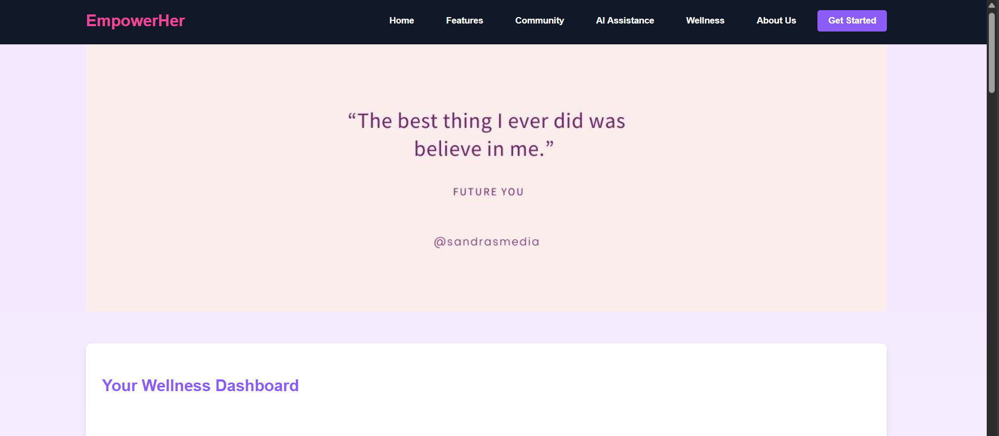

# EmpowerHer

Full stack mental wellness website built with HTML, CSS, Javascript, Node.js, Express, and Mongodb.

Note: The backend is hosted on local server for now
## Features
- Peer Support forum
- Create, update, and delete posts and comments
- Period Tracker
- Health Tracker
- AI Assistance using chatbots
- Write Journal
- Create To Do lists
- Mental Health Awareness
- Solution Remdies for Mental Health
- ... and more to come!

## Screenshots
<p align="center">
  <a href="#">
    
  </a>
</p>

## Installation
1. Clone this repository

```
git clone https://github.com/PrathamR015/EmpowerHer
cd EmpowerHer
```

2. Install backend dependencies

```
cd backend
npm install
```

3. Install frontend dependencies

```
cd frontend
npm install
```


```

5. Configure environment variables. Create a `.env` file in the config folder, and paste the following (filling in your own postgres password and JWT secret)
```
PORT=5000
MONGO_URI=mongodb://localhost:27017/empowerher
JWT_SECRET=<YOUR_SECRET>


```

6. Create a Mongodb database named 'EmpowerHer'

7. Run the database migrations

```
cd backend
npm run db-migrate up
```

## Usage
1. Start server

```
cd backend
node server.js
```

2. Start client
```
open index.html
```
